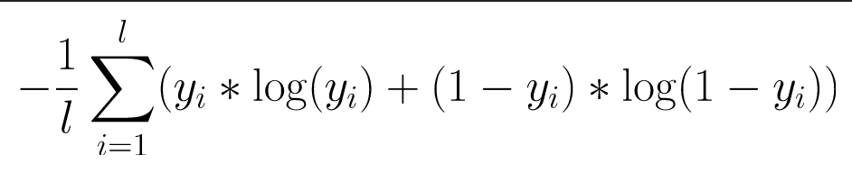
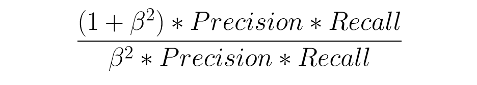
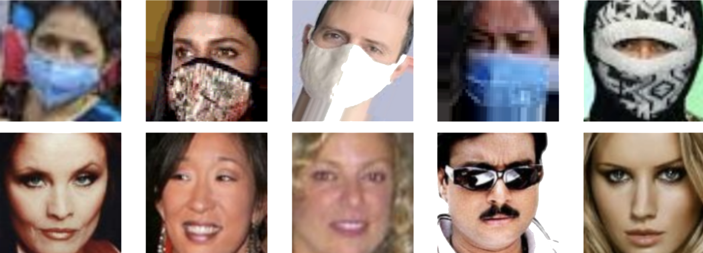
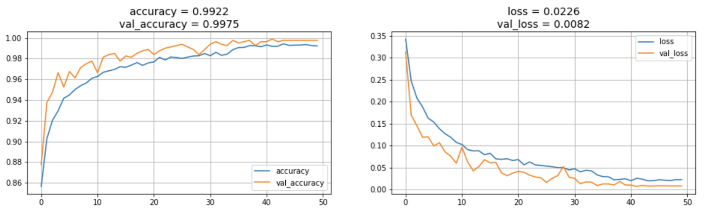
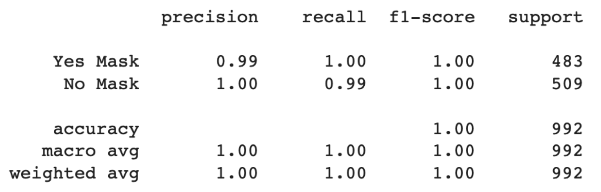
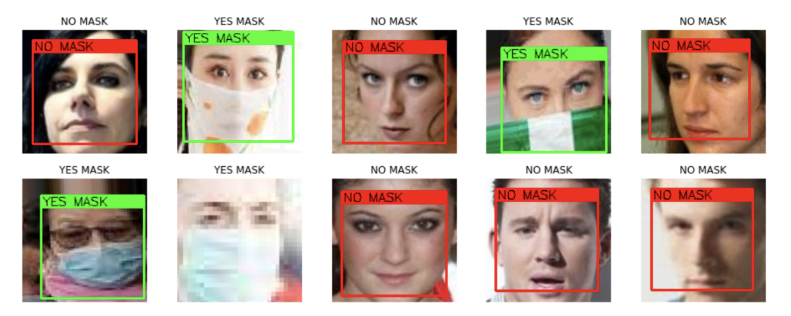
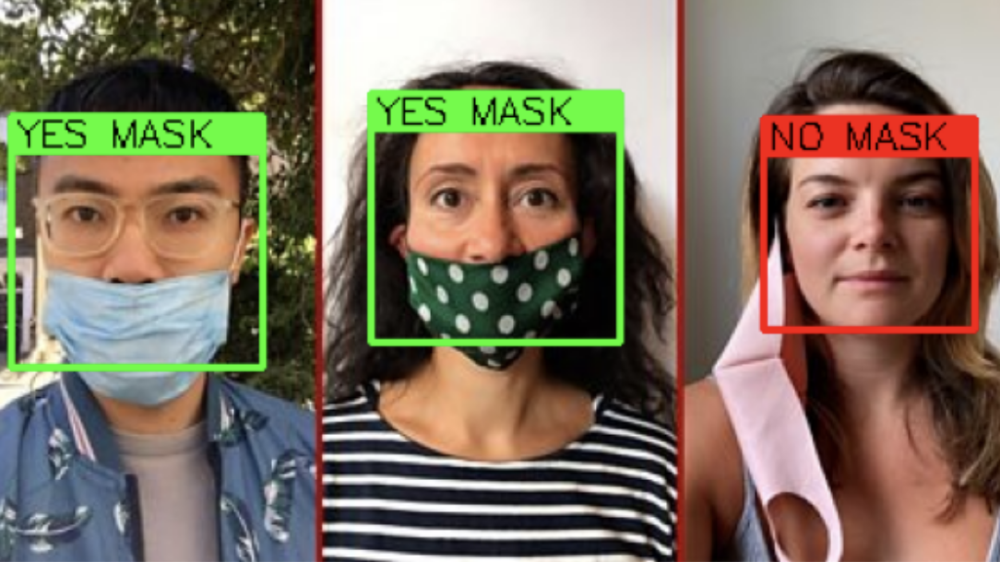
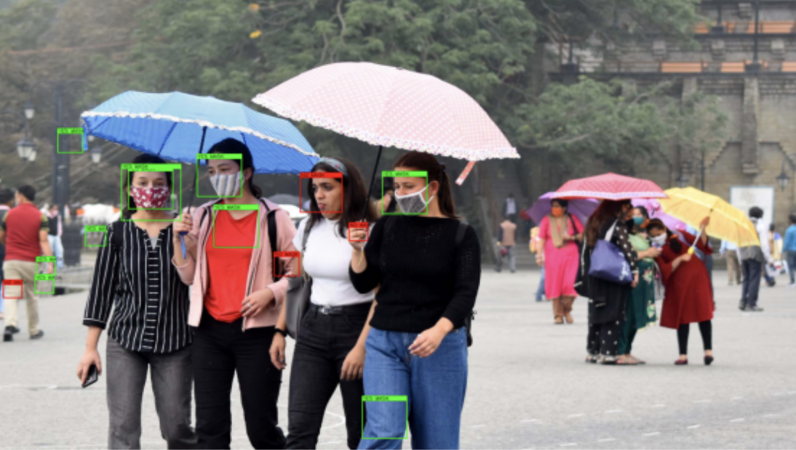

# Real-Time Face Mask Detection

## Info

Hello, COVID 👋 😷

It is necessary to attribute the image received at the input to one of the classes — to determine the presence of a mask on the face or its absence.

The classifier will be considered successful if at least 90% of the variants are correctly classified.

An additional task was the work of the classifier in real time. In this case, detection and classification through the laptop camera.

## Metrics

|             |                        |
|:-----------:|:----------------------:|
|  Accuracy   |   |
|    Loss     |       |
|  Precision  |  |
|   Recall    |     |
|   F-score   |    |

## Sample data

## Score model

## Prediction

